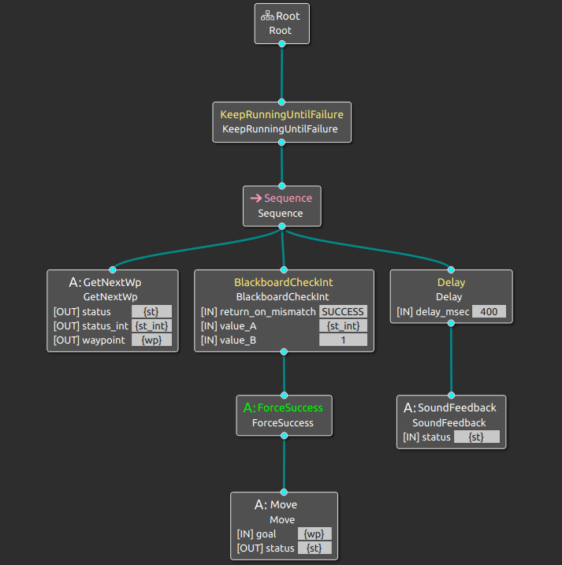

# Práctica de navegación

[](https://github.com/Docencia-fmrico/navigation)


**Entrega:** Miércoles 2/3 

En la moqueta verde del laboratorio se limitará con unas paredes, y se pondrán obstáculos (cajas) dentro el viernes 25/2. No habrá cambios en el escenario desde este momento. El miércoles, al inicio de la clase se proporcionarán un conjunto de waypoints en un fichero de parámetros como este:

```
patrolling_node:
  ros__parameters:
    waypoints: ["wp1", "wp2"]
    wp1: [1.0, 1.0]
    wp2: [-1.0, -1,0]
```

El robot debe ir en orden la coordenada (x, y) de cada uno de ellos, emitiendo un sonido cuando lo considera alcanzado. Se cronometrará el tiempo que tarda en hacerlo.

La velocidad lineal no podrá ser nunca superior a 0.4. Se descalificará a quien incumpla esta regla.

Habrá dos rondas:

- Ronda 1: Habrá 4 waypoints, y ninguno en la posición de un obstáculo.
- Ronda 2: Habrá 3-7 waypoints, alguno de ellos en la posición de un obstáculo. En este caso, se podrá ir al siguiente en cuanto se detecte este caso.


# Behavior Tree diagram 



The behavior tree is designed to perform the task of going to a specific number of waypoints located in the map using Nav2 for ROS 2. For this purpose we separated it into three main actions, the "GetNextWp" that gets the next waypoint coordinates from the params file and verifies that it can be reached, the "Move" action that passes those points to the Nav2 program and waits for the navigation result, and the "SoundFeedback" that publishes a different message on the sound topic depending on the navigation outcome. We also tried to implement a "LedFeedback" similar to the sound one but we ran into some linking problems and finally decided to not add it.
